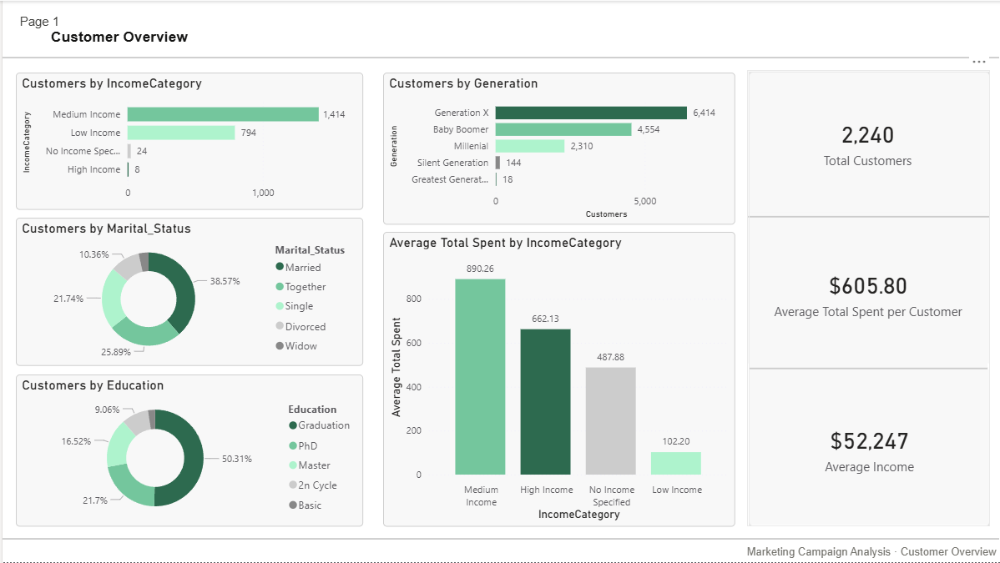
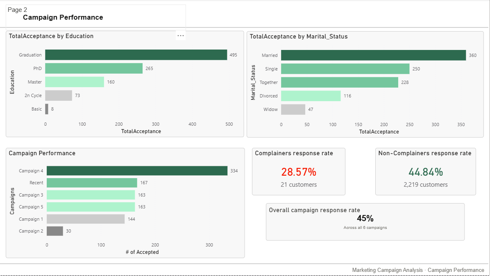
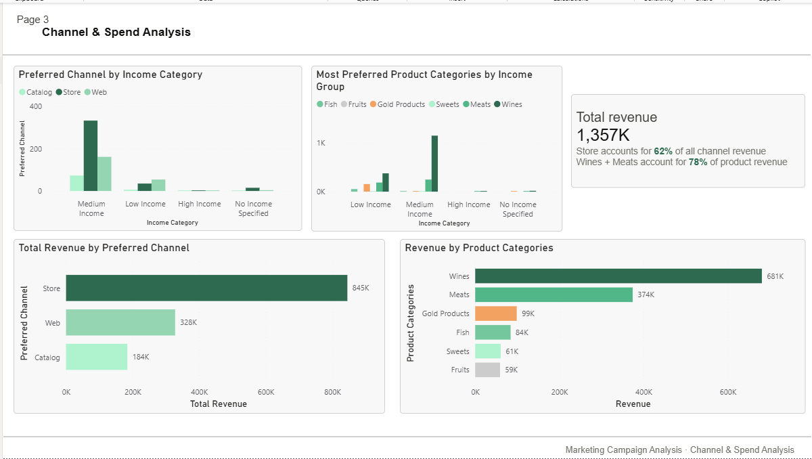
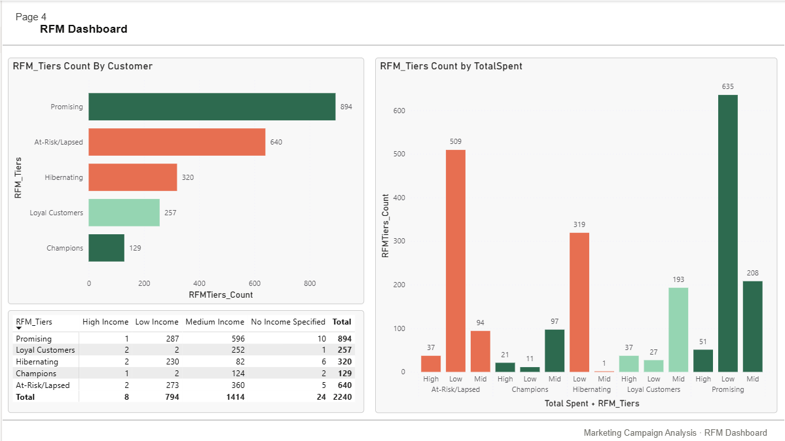

# Marketing Campaign Analysis
**Tool:** SQL Server (SSMS) · Power BI  
**Dataset:** [Kaggle — Marketing Campaign Dataset](https://www.kaggle.com/datasets/rodsaldanha/arketing-campaign)  
**Author:** Lawrence André Q. Cabana · [LinkedIn](https://www.linkedin.com/in/lawrence-andr%C3%A9-cabana-1306b7295/)

---

## Overview

This project analyzes customer-level data from a retail company's marketing campaigns to identify high-value customer segments, evaluate campaign performance, and surface actionable recommendations for future targeting strategy.

The analysis was conducted entirely in SQL Server using SSMS for data preparation, exploration, and querying, with Power BI used for visualization and reporting.

---

## Business Problem

A mid-size retail company has run several marketing campaigns but is seeing diminishing returns on ad spend. The marketing team needs to understand which customer segments are most likely to respond positively to future campaigns, and which channels and offer types drive the highest engagement, in order to reduce wasted budget and improve targeting.

---

## Dataset

- **Source:** Kaggle — Marketing Campaign Dataset (rodsaldanha/arketing-campaign)
- **Records:** 2,240 customers
- **Features:** Customer demographics, purchase history across 6 product categories, channel behavior, campaign response flags, and complaint history

---

## Tools Used

| Tool | Purpose |
|---|---|
| SQL Server (SSMS) | Data cleaning, feature engineering, analysis queries, views |
| Power BI Desktop | Dashboard and report visualization |

---

## Data Preparation

All data preparation was performed in SQL Server. The following custom columns were engineered from existing data:

| Column | Description |
|---|---|
| `Age` | Derived by subtracting `Year_Birth` from 2014 (dataset creation year) |
| `Generation` | Generational group based on birth year ranges |
| `TotalSpent` | Sum of all six product category spend columns |
| `MostCategorySpent` | Product category with the highest spend per customer |
| `IncomeCategory` | Income binned into Low (≤$42K), Medium ($42K–$126K), High (>$126K) |
| `SpendingFrequency` | Total number of purchases across all channels |

**Cleaning steps:**
- 24 null `Income` values labeled as `'No Income Specified'` (~1% of dataset, negligible impact)
- Marital status values `'Absurd'`, `'YOLO'`, and `'Alone'` consolidated into `'Single'`

---

## Analysis Questions

| # | Question |
|---|---|
| Q1 | Using income, age, and spending behavior, can you identify distinct customer groups? |
| Q2 | Which customer segments responded most positively to past campaigns? |
| Q3 | Which purchase channels generate the most revenue? Does preference vary by segment? |
| Q4 | How recently and frequently do high-value customers purchase? Can they be classified into RFM tiers? |
| Q5 | Which product categories drive the most spend? Are there cross-sell opportunities? |
| Q6 | Do complainers show lower campaign response rates? What does this imply for recovery strategy? |

---

## Key Findings

- **Medium income customers** are the company's dominant segment — they account for the majority of revenue, campaign acceptances, and high-spend RFM tier classifications
- **Wines and meats** are the top two product categories by total spend and consistently co-purchased, presenting a clear cross-sell opportunity
- **In-store** is the highest-revenue channel, strongly preferred by medium income customers; the web channel is the primary channel for low income customers
- **Complainers** show a 28.57% campaign response rate vs 44.84% for non-complainers, a meaningful gap despite low complaint volume (21 customers)
- **894 customers** fall into the Promising RFM tier, representing the largest opportunity for conversion to Champions with targeted campaigns
- **640 customers** are classified as At-Risk/Lapsed and should be prioritized for re-engagement

---

## Recommendation

The company should concentrate its next campaign on **medium income, married or partnered, degree-educated customers** purchasing through the in-store channel. Wine and meat bundle promotions aligned to this segment's spending behavior are the most direct path to improving campaign ROI.

A separate re-engagement track should be developed for the 37 high-spend At-Risk customers, and a recovery-focused communication approach applied to the 21 complaint customers rather than a standard campaign.

---

## Repository Structure

```
├── queries/
│   └── marketing_campaign_queries.sql   # All analysis queries and views
├── findings/
│   └── marketing_campaign_findings.pdf  # Full write-up with findings and implications
├── visuals/
│   ├── page1_customer_overview.png
│   ├── page2_campaign_performance.png
│   ├── page3_channel_spend.png
│   └── page4_rfm_dashboard.png
└── README.md
```

---

## Dashboard Preview

### Page 1 — Customer Overview


### Page 2 — Campaign Performance


### Page 3 — Channel & Spend Analysis


### Page 4 — RFM Dashboard


---

*This project is part of an ongoing data analyst portfolio. More projects coming soon.*
